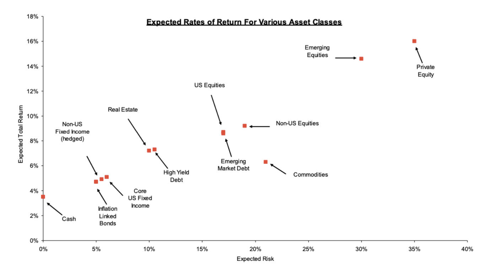

# Abstract

The research paper provides an analysis of the All-Weather portfolio
approach's effectiveness in portfolio construction. It validates
Bridgewater Associates' 2009 research by examining market data over and
replicating the investment strategy using ETF funds. The study
identifies that traditional portfolios, which are typically heavily
concentrated in equity securities, tend to incur higher risks for lower
returns. The All-Weather strategy can be used as a case study to
construct portfolios that can achieve attractive risk and return
profiles. Different portfolio modelling techniques are implemented to
test portfolio performance. There is potential for investors to optimize
returns and manage risks more efficiently through strategic asset
diversification, geographic allocation, and correlation analysis. The
paper highlights the All-Weather approach's, while addressing the
limitations of this model​​.

# 1. Introduction

The concept of the All-Weather Portfolio, pioneered by Bridgewater
Associates, embodies a strategy of asset diversification designed to
generate resilient returns across various market conditions.
Characterized by its diversified asset composition, this portfolio
paradigm seeks to transcend traditional portfolio management by offering
a shield against diverse market fluctuations.

Historical analyses of institutional portfolios reveal a recurring theme
of suboptimal asset diversification, with an estimated 75% to 80% of
portfolio risk typically tethered to equity securities. Such a
configuration exposes these portfolios to the full brunt of stock market
volatilities, a phenomenon markedly evident in portfolios with an equity
concentration as high as 90% (Bridgewater Associates, LP, 2009). Figure
6 (Appendix) represents the cumulative performance of the different
stock market during the period 1900 -- 2019. The obvious observation is
that if in this period the investor had decided to follow a
geographically diversified approach by investing equally on his
portfolio in the five selected countries, the investor would have
realized a cumulative performance of the portfolio approaching the best
result on this analysis the return of an investment on the US equity
market (Bridgewater Associates, LP, 2019).

The principles of Modern Portfolio Theory, as formulated by Harry
Markowitz, underscore the virtues of diversification. Markowitz's
seminal work suggests that a well-diversified portfolio, characterized
by maximum decorrelation among its constituents, can enhance
performance. Neglecting such diversification could result in the
forfeiture of substantial returns, measured in hundreds of basis points.
The addition of geographic diversification further underscores this
point. The 20th-century investment landscape offers poignant lessons,
where countries like Russia and Germany faced systemic crises in the
1920s, leading to colossal investor losses. Figure 7 (Appendix)
represents the worst equity excess return drawdowns across countries
Geographic diversification is an important vector of performance for the
overall return of the portfolio, as evidenced by the results of previous
centuries where investments concentrated on a single country, such as
Russia in the early 1920s and Germany in the mid-1920s, both of which
experienced systemic crises resulting in significant losses for
investors and a total loss on a portfolio concentrated on a single
country.

In contrast, a hypothetical portfolio evenly distributed across five
selected countries during the same period would have yielded cumulative
returns comparable to those of the robust U.S. equity market
(Bridgewater Associates, LP, 2019). Figure 8 (Appendix) represents the
cumulative excess returns of an equally weighted geographically
diversified portfolio of stocks and bond compared to a concentrated
investment in the US and global set of countries. If we take the
analysis a step further, the performance of a geographically diversified
portfolio with an equal allocation has consistently outperformed over
the last 70 years (Bridgewater Associates, LP, 2019). Extending this
analysis reveals that for the past seven decades, a geographically
diversified portfolio with equal allocation has consistently delivered
superior performance.

This strategic allocation not only bolstered returns but also mitigated
maximum potential losses, as reflected in the drawdown analysis of the
portfolio's components (Bridgewater Associates, LP, 2019). Figure 9
(Appendix) represents the maximum drawdown of an equally weighted
geographically diversified portfolio of stocks and bond compared to a
concentrated investment in the US and global set of countries. This
consistency in the result is done while minimizing the maximum losses of
the portfolio, as evidenced by the drawdowns between the different
components of the analysis (Bridgewater Associates, LP, 2019).

The conventional wisdom advocating a 60/40 asset-to-bond allocation
ratio is predominantly driven by the asset component's performance,
which demonstrates a staggering 95% correlation with the portfolio's
overall returns. This relationship challenges the common investor
assumption that a 40% bond allocation constitutes effective
diversification (Bridgewater Associates, LP, 2009). Figure 10 (Appendix)
represents the correlation analysis of the drawdowns of a 60/40
portfolio. X-axis represent the period analysed, while the y-axis
represents the overall drawdown of the portfolio analysed (Bridgewater
Associates, 2009).

It is essential to revisit the foundational principles of portfolio
construction, particularly the risk/return profiles of various asset
classes and their alignment with an investor's risk tolerance. The quest
for an 8% return traditionally directs investors towards a heavy
reliance on equities. However, the All-Weather approach introduces a
nuanced strategy, suggesting that leveraging assets can optimize the
risk/return ratio without compromising diversification (Bridgewater
Associates, LP, 2009). Figure 11 (Appendix) represents the risk-return
of different asset classes. X-axes represent the expected risk of each
asset, while the y-axis represents the overall expected total return of
each asset in the graph (Bridgewater Associates, 2009).

It is important to stress the key to getting the best possible return is
to differentiate between combinations of slightly correlated assets and
combinations of highly correlated assets, since a low correlation, or
even a negative correlation, is a driver of portfolio return. Figure 12
(Appendix) represents the risk-return of different asset classes. X-axis
represent the period analysed, while the y-axis represents the
performance of each asset selected in the analysis (Bridgewater
Associates, LP, 2009). In this sense, we can analyse the effect of the
correlation on the risk incurred by the portfolio, where a correlation
of 60% would imply a probability of loss of funds of 38% annually, for a
risk/return ratio of 0.31, while a portfolio with a neutral correlation
will have a much lower probability of loss (of the order of 11%) while
having an improved risk/return ratio (of the order of 1.25, i.e.
practically five times the return of the former).

The All-Weather Portfolio approach aims at incorporating different asset
classes in its allocation while scrupulously respecting the increase and
decrease matrix in inflation and growth conditions to naturally
neutralize the losses of one asset with the gains of another asset class
and all this without forgetting the geographical diversification factor
which is integrated into the portfolio construction (Bridgewater
Associates, LP, 2009).

# 2. Modeling of the all weather portfolio

## 2.1 Mathematical foundations

This part structures the mathematical foundations used in the modeling
part of this paper. All formulas are extracted from Clauss (2011).

### 2.1.1 Markowitz Portfolio construction

The return on an asset is based on its return and its portfolio
weighting. The portfolio return can be calculated using the following
formula:

$$\sum_{i=1}^{N} w_i \cdot r_i$$

The portfolio return expression is then used to calculate two critical
portfolio features for investors: expected performance as indicated by
the average return and risk as indicated by the standard deviation of
returns.

The standard deviation of the portfolio's returns is calculated using
the following formula:

$$
\sigma_P = \sqrt{\sum_{i=1}^{N} \sum_{j=1}^{N} w_i \cdot w_j \cdot \rho_{ij} \cdot \sigma_i \cdot \sigma_j}
$$

where wi is asset's weight i, wj is the asset's weight j, rho i is the
asset's standard deviation, rho j is the asset's standard deviation and
rho i, j is the correlation between the assets i, j.

Due to the computational burden associated with relying on many assets,
we can employ the matrix form for easier implementation. Essentially, we
multiply the weight vector by the variance-covariance matrix and the
transpose of the weight vector:

$$
\sigma_P = \sqrt{w \cdot \Sigma \cdot w'}
$$

where w is the vector of weights, sigma is the matrix of
variance-covariance and w' is the weight vector transposed.

### 2.1.2 GMV portfolio construction

The GMV portfolio is only based on the covariance matrix estimation.
This matrix estimator is inversed in the formula to determine the
weights of the portfolio. The unbiased estimator of the inverse
covariance matrix can be approached as:

$$
\hat{\Sigma}{\text{unbiased}} = \frac{1}{T - n - 2} \sum{t=1}^{T} (r_t - \hat{\mu})(r_t - \hat{\mu})'
$$

where $\hat{\mu} = \frac{1}{T} \sum_{t=1}^{T} r_t$ is an estimator for
the mean returns, T the number of observations, n the number of assets
and rt the vector of financial returns for the n assets observed at time
t.

### 2.1.3 PCA Analysis

Mathematically we can approach it as:

$$
\hat{\Sigma}_{3\text{factors}} = \Phi_f \Lambda_f \Phi' + \Sigma\epsilon
$$

The variance of the residuals $\epsilon_i$ can be computed as (Clauss,
2011):

```{=tex}
\begin{equation}
\text{Var}(\epsilon_i) = \text{Var}(r_i) - \phi_{i1}^2 \lambda_1 - \phi_{i2}^2 \lambda_2 - \phi_{i3}^2 \lambda_3
\end{equation}
```
with $\Lambda_f$ representing the diagonal matrix of the first three
eigenvalues of the unbiased estimator of the covariance matrix, $\Phi_f$
the matrix with the first three eigenvectors, and $\Sigma_{\epsilon}$
the diagonal residual covariance matrix determined for each asset $i$.

### 2.1.4 Black-Litterman approach

The weights in a Black-Litterman can be approached as:

$$
\omega = \frac{1}{A} \tilde{\Sigma}^{-1} \tilde{\mu}
$$

with $\tilde{\Sigma}$ the covariance matrix between assets returns of
length $n \times n$, $\tilde{\mu}$ the vector of the expected excess
returns equal to $\mu - r_f e$ with $\mu$ the expected returns, $r_f$
the risk-free rate and $e$ a vector of 1 of length $n$ and finally.

The unbiased estimator for mu and covariance can be approached as
follows:

$$
\tilde{\mu} = \frac{1}{T} \sum_{t=1}^{T} (r_t - r_f)
$$

with rt is as the return of the asset at time t and rf as the risk-free
rate asset return at time t.

The unbiased covariance estimator can be approached similarly as the the
Global Minimum Variance (GMV) case (Clauss, 2011):

$$
\tilde{\Sigma} = \frac{1}{T - n - 2} \sum_{t=1}^{T} (r_t - \hat{\mu})(r_t - \hat{\mu})'
$$

Black-Litterman approach is quantitative approach that integrate
investor views in a relevant way. This method adds to economic
predictions statistical uncertainty. It is based on a Bayesian approach
(Clauss, 2011).

The Black-Litterman returns are the following mixed estimates:

$$
\hat{\mu}_{mixed} = \left( \tau \tilde{\Sigma}^{-1} + \Omega^{-1} \right)^{-1} \left[ \tilde{\Sigma}^{-1} \hat{\mu} + \Omega^{-1} Q \right]
$$

with $Q$ the economic views quantified by average returns, $\tau$ the
confidence parameter in the views and $\Omega$ the matrix of uncertainty
associated with the economic views; we assume that $\Omega$ is a
diagonal matrix with diagonal elements equal to variances of assets
returns.

## 2.2 Packages

The modeling is conducted in R program.

We import the necessary libraries to perform the first analysis.

1.  **library(tidyverse):** The tidyverse package constitutes a
    collection of R packages meticulously designed to work seamlessly in
    unison for data manipulation, visualization, and analysis. It
    encompasses packages like ggplot2 for data visualization, dplyr for
    data manipulation, tidyr for data tidying, and more. Loading
    tidyverse avails all these packages for utilization during your R
    session, streamlining your data analysis workflow.

2.  **library(quantmod):** The quantmod package primarily caters to
    quantitative financial modeling and analysis. It furnishes an array
    of functions and tools for handling financial data, such as
    downloading and managing stock price data, conducting technical
    analysis, and modeling financial time series.

3.  **library(DataExplorer):** The DataExplorer package serves the
    purpose of preliminary data exploration and analysis. It offers
    functions to generate summary statistics, visualize missing data,
    plot variable distributions, and more. It can aid in obtaining a
    quick overview of your data before delving into more extensive
    analyses.

4.  **library(corrplot):** The corrplot package specializes in
    visualizing correlation matrices. It provides functions for
    generating visually appealing and informative correlation plots,
    which prove valuable for comprehending relationships between
    variables within your data.

5.  **library(scales):** The scales package provides an assortment of
    scales and formatting functions tailored for R graphics. It is often
    employed in conjunction with other plotting packages, such as
    ggplot2, to customize the appearance of plots, including axes,
    labels, and color scales.

```{r Packages, include=FALSE}
library(tidyverse)
library(quantmod)
library(DataExplorer)
library(corrplot)
library(scales)
library(tinytex)
```

## 2.3 Investment universe

### **2.3.1 Investment universe**

This investment universe is designed to provide diversified exposure
across a range of asset classes, including broad market indices,
emerging market equities, government bonds, commodities, and precious
metals. This selection is intended to balance risk and return while
capturing growth opportunities and providing a hedge against inflation.

-   VTI (Vanguard Total Stock Market ETF): Broad exposure to the global
    stock market.

-   EMGF (iShares MSCI Emerging Markets Multifactor ETF): Exposure to
    emerging markets with favorable exposure to value, quality,
    momentum, and size factors.

-   IEF (iShares 7-10 Year Treasury Bond ETF): Exposure to
    intermediate-term government bonds.

-   DBC (Invesco DB Commodity Index Tracking Fund): Exposure to a basket
    of commodities.

-   GLD (SPDR Gold Trust): Exposure to gold.

### **2.3.2 Economic data**

To connect our investment universe selection to the asset allocation, we
can refer to market outlooks from the prominent Wall Street most
reliable market commentaries. We take the economic data from Goldman
Sachs Asset Management, BlackRock, and JPMorgan Asset Management:

| Firm      | Global GDP Growth | US GDP Growth | Eurozone GDP Growth | China GDP Growth | S&P 500 Earnings | US 10-year Treasury Yield |
|-----------|-----------|-----------|-----------|-----------|-----------|-----------|
| BlackRock | +3.1%             | +2.3%         | +2.1%               | +5.3%            | +10%             | 3.3%                      |
| GSAM      | +2.8%             | +1.8%         | +0.6%               | +5.0%            | +6%              | 3.5%                      |
| JPMAM     | +3.2%             | +2.0%         | +2.0%               | +5.2%            | +8%              | 3.0%                      |

Source: Data from BlackRock, Goldman Sachs Asset Management (GSAM), and
J.P. Morgan Asset Management (JPMAM), 2023.

On average, the three financial institutions expect global GDP growth of
+3.0% in 2023, US GDP growth of +2.0%, and S&P 500 earnings growth of
+8%. They also expect the US 10-year Treasury yield to reach 3.3%.

In terms of asset allocation, all three institutions are overweight on
equities, with Goldman Sachs Asset Management being the most overweight.
They are also underweight on bonds, with JPMorgan Asset Management being
the most underweight.

Overall, the market outlooks from these three financial institutions
suggest that equities are still the preferred asset class for 2023,
despite the expected slowdown in economic growth. Investors should
consider diversifying their portfolios with other asset classes, such as
bonds and commodities, to reduce risk.

This investment universe is a good option for investors who are looking
for a diversified portfolio that offers the potential for both growth
and income. The assets in this universe are supported by economic data,
market outlook, and investment considerations.

### 2.3.3 Rationale

We have carefully chosen a set of five trackers (ETFs) to represent our
investment universe. An ETF can be defined as a financial product that
is based on a basket of different assets, to replicate the actual
performance of each selected investment. An ETF has more or less the
same proportion of the underlying components of the basket, depending on
the style of management of the asset manager. Below is the
Exchange-Traded Funds (ETF) chosen as the investment universe:

-   **Equities (VTI):** VTI provides broad exposure to the global stock
    market, which is expected to benefit from economic growth.

-   **Emerging market equities (EMGF):** EMGF provides exposure to
    emerging markets with favorable exposure to value, quality,
    momentum, and size factors. Emerging markets have the potential for
    higher growth than developed markets, but they also come with more
    risk. EMGF mitigates some of the risk by investing in companies with
    favorable exposure to specific factors.

-   **Government bonds (IEF):** IEF provides exposure to
    intermediate-term government bonds, which are typically considered
    to be low-risk investments. This can provide stability to a
    portfolio in times of economic uncertainty.

-   **Commodities (DBC):** DBC provides exposure to a basket of
    commodities, which can be a good way to diversify a portfolio and
    hedge against inflation. However, it is important to note that
    commodities are volatile investments.

-   **Precious metals (GLD):** GLD provides exposure to gold, which is a
    traditional safe haven asset that can provide protection against
    inflation and market volatility.

Overall, this investment universe is well-diversified and offers a mix
of assets with different risk and return profiles. This makes it a good
choice for investors with a variety of investment objectives and time
horizons.

Our selection strategy is based on several fundamental considerations:

-   **Investment universe:** The investment universe aims at
    representing different asset classes in order to construct a
    multi-asset portfolio.

-   **Diversification strategy:** Our commitment to constructing a
    well-rounded portfolio has been affirmed through diversification
    across various sectors and industries. Such diversification is a
    critical risk management tool, curbing overexposure to a single
    sector or asset class.

-   **Historical data availability:** The selected trackers benefit from
    a rich repository of historical data and extensive research. The
    accessibility of such data enable these ETFs to rigorous portfolio
    management analysis and comprehensive research.

```{r Investment universe data extraction, include=FALSE}
# Define the stock tickers you want to fetch data for
stock_tickers <- c("VTI", "EMGF", "IEF", "DBC", "GLD")

# Fetch historical stock data from Yahoo Finance
start_date <- "2019-01-01"  # Replace with your desired start date
end_date <- "2023-08-31"    # Replace with your desired end date

# Use getSymbols to fetch data for all stock tickers
stock_data <- getSymbols(stock_tickers, from = start_date, to = end_date, auto.assign = TRUE)
```

## 2.4 Data cleaning and analysis

### 2.4.1 Data cleaning

We initiate data cleaning, a crucial step in data analysis:

-   **Extracting adjusted closing prices:** We use the lapply function
    to obtain adjusted closing prices, commonly used for return
    calculations, for a list of stock tickers. This code iterates
    through each ticker and fetches the adjusted closing prices.

-   **Combining stock returns:** To consolidate the adjusted closing
    prices, we employ cbind, creating a data frame where each column
    represents a specific stock's adjusted closing prices.

-   **Renaming columns:** We label the columns with their corresponding
    stock tickers, facilitating easy identification.

-   **Handling missing data:** We remove rows with missing values from
    the dataset for quality and consistency.

```{r Return calculations, include=FALSE}
# Extract adjusted closing prices (which are typically used for returns)
stock_returns <- lapply(stock_tickers, function(ticker) {
  to.monthly(Ad(get(ticker)), indexAt = 'lastof', OHLC = FALSE)
})

# Combine stock returns into a single data frame
fin_prices <- do.call(cbind, stock_returns)

# Eliminate missing data in time series
fin_return <- na.omit(fin_prices)  # Remove rows with missing values

```

Arithmetic returns are used for performance assessment, offering a clear
view of gains and losses, suitable for short-term analysis, and ensuring
transparency.

```{r Arithmetic returns, include=FALSE}
# Computation of returns
arith_fin_returns = diff(fin_return)/lag(fin_return)
head(arith_fin_returns, n=3)
arith_fin_returns <- arith_fin_returns[-1, ]

```

```{r Data exploration multi-asset, include=FALSE}
# Data exploration for the return time series. In order to ensure that the data is properly imported, with non missing values and proper data cleaning procedure, we can implement this line of code in order to learn more about data.
plot_intro(arith_fin_returns)
```

### **2.4.2 Data analysis**

Data ranges from 01/01/2019 to 31/08/2023, capturing the period before
and after the Covid 19 pandemic.

We plot the rebased performance of the trackers selected in our
investment universe. From the graph below, we can clearly see the out
performance of equity tracker (VTI) by a considerable margin with
respected to the other asset classes.

The equity market has outperformed all of the other asset classes
mentioned above since 2019 for a number of reasons.

-   **Strong economic growth:** The global economy has grown at a
    healthy pace since 2019, which has supported corporate earnings
    growth. This has made equities more attractive to investors.

-   **Low interest rates:** Interest rates have been low since 2019,
    which has made equities more attractive relative to other asset
    classes, such as bonds.

-   **Government stimulus:** Governments around the world have enacted a
    number of stimulus measures to support the economy during the
    COVID-19 pandemic. This has boosted consumer spending and
    investment, which has benefited equities.

-   **Corporate earnings growth:** Corporate earnings have grown
    strongly since 2019, as companies have benefited from the strong
    economy and low interest rates. This has made equities more
    attractive to investors.

The equity market is the riskiest of the asset classes mentioned above
because it is more volatile and subject to larger swings in price.
However, it has also been the most rewarding asset class over the long
term, as it has generated higher returns than other asset classes, such
as bonds and commodities.

Here are some additional insights on the outperformance of the equity
market:

-   The equity market has benefited from a number of technological
    trends, such as the rise of e-commerce and cloud computing. These
    trends have led to the growth of new companies and industries, which
    has created new investment opportunities for investors.

-   The equity market has also benefited from the globalization of the
    economy. Companies are now able to operate in multiple countries,
    which has helped them to grow their businesses and increase their
    profits.

-   The equity market has become more accessible to individual investors
    in recent years. This has led to an increase in demand for equities,
    which has helped to drive up prices.

Overall, the equity market has outperformed all of the other asset
classes mentioned above since 2019 due to a number of factors, including
strong economic growth, low interest rates, government stimulus,
corporate earnings growth, technological trends, globalization, and
increased access for individual investors.

```{r Cumulative return plot 2, fig.cap="Cumulative return of funds across the analysed period.", echo=FALSE, fig.pos='H'}

# Calculate Cumulative Returns
cumulative_returns <- cumprod(1 + arith_fin_returns)

# Plot Cumulative Return Performance
# library(ggplot2)
# autoplot(cumulative_returns, facets = NULL) +
#   ggtitle("Cumulative Return Performance of the investment universe") +
#   ylab("Cumulative Return") +
#   xlab("Year")

```

To enhance our data analysis, we can perform statistical analysis on the
monthly returns of each stock. This helps us evaluate their performance
and behavior during the observed time frame. Please note that the
figures derived from this analysis are presented in monthly returns.

```{r summary statistics multi-asset, include=FALSE}
# Statistical summary of returns for each asset class

summary(arith_fin_returns)
```

Using monthly data to smooth the data and transform it to a close
approximation to the Gaussian distribution has several advantages
(Clauss, 2011):

-   **Reduced noise:** Monthly data is less noisy than daily or weekly
    data. This is because it averages out the short-term fluctuations in
    the data.

-   **Improved normality:** Monthly data is more likely to be normally
    distributed than daily or weekly data. This is because the Central
    Limit Theorem states that the distribution of the sum of a large
    number of independent and identically distributed random variables
    will be approximately normal, even if the original distribution is
    not normal.

-   **Easier to model:** Gaussian distributions are easier to model than
    other types of distributions. This is because there are a number of
    well-established statistical methods for modeling Gaussian
    distributions.

There are also some disadvantages to using monthly data to smooth the
data and transform it to a close approximation to the Gaussian
distribution:

-   **Loss of information:** Monthly data is less informative than daily
    or weekly data. This is because it averages out some of the detail
    in the data.

-   **Time lag:** Monthly data has a time lag. This means that it does
    not reflect the latest changes in the underlying data.

Overall, the utility of using monthly data to smooth the data and
transform it to a close approximation to the Gaussian distribution
depends on the specific application. In order to reduce noise and
improve normality, then using monthly data is a good option. However, if
the goal is to capture the latest changes in the data or to preserve all
of the information in the data, then using more frequent data is a
better option.

```{r Advanced plots Gaussian and QQ, include=FALSE}
# Advanced statistical analysis for the dataset

plot_density(arith_fin_returns)
plot_qq(arith_fin_returns)
```

Correlation is a fundamental concept related to diversification, which
seeks to use poorly correlated and non correlated assets to construct a
portfolio. Diversification aims to boost returns while minimizing risk
by investing in assets that respond differently to various events.
Prudent investors seeking risk mitigation will diversify their
portfolios.

In our investment universe, opportunities for diversification arise.
Defensive assets like gold (TICKER: GLD) can effectively diversify when
combined with more aggressive ones. For instance, the Vanguard Total
Index tracker (TICKER: VTI) has a poor correlation with gold (TICKER:
GLD). iShares 7-10 years Treasuries Index tracker (TICKER: IEF) exhibits
negative correlation with respect to international and emerging market
equities (Figure 1).

```{r Correlation-multi-asset-portfolio, fig.cap="Correlation analysis of the funds returns.", echo=FALSE, fig.pos='h'}
# Correlation analysis

library(corrplot)
corrplot( cor(arith_fin_returns), type='lower', method = "shade", tl.col = 'black', cl.pos = "r", tl.cex = 1)
```

## 2.5 Modelling of the portfolio

### 2.5.1 Unbiased Global Minimum Variance (GMV) portfolio

Modern Portfolio Theory (MPT) is founded on several market and investor
assumptions. Several of these assumptions are stated explicitly, while
others are implied. Markowitz's contributions to (MPT) in portfolio
selection are based on the following basic assumptions (Markowitz,
1952): 

-   Investors are rational (they seek to maximize returns while
    minimizing risk, or minimize risk while maximize return).

-   Investors will accept increased risk only if compensated with higher
    expected returns.

-   Investors receive all relevant information regarding their
    investment decision.

-   Investors can borrow or lend an unlimited amount of capital at a
    risk-free rate of interest.

In the context of time series data analysis, one of the crucial
applications is the division of the data set into a training set and a
testing set based on temporal order. This approach is particularly
important when dealing with data that evolves over time, such as stock
prices in this instance.

The training set typically comprises historical data, while the testing
set contains more recent observations. This temporal separation allows
for the evaluation of predictive models and forecasting techniques. By
using historical data to train the model and then assessing its
performance on more recent data, analysts can gauge the model's ability
to make accurate predictions and anticipate future trends. Time series
data applications are essential in fields like finance, where
understanding and forecasting trends over time is important.

For the purpose of modelling, we will shrink the data set into two
different sub-samples. We can define the following parameters:

```{r Subsampling of data, include=FALSE}
num_rows_subsample1 <- 20
total_rows <- nrow(arith_fin_returns)
```

1.  The first sub-sample will cover the first 20 trading month covered
    in the data set.

```{r Subsample 1 data structure, include=FALSE}
subsample1 <- arith_fin_returns[1:num_rows_subsample1, ]
plot_intro(subsample1)
```

2.  The second sub-sample will cover the rest of the data set, covering
    the equivalent of 36 trading month.

```{r Subsample 2 data structure, include=FALSE}
subsample2 <- arith_fin_returns[(num_rows_subsample1 + 1):total_rows, ]
plot_intro(subsample2)
```

```{r Parameters calculations, echo=FALSE}

#Definition of parameters
n <- ncol(subsample1)
T <- nrow(subsample1)
e <- rep(1, n)
perio <- 12

#Compute Sigma (unbiased covariance matrix)
#We proceed with a regularization procedure: In order to compute an inverse, we can add a small positive value to the diagonal of the matrix to make it invertible. This technique is known as "Tikhonov regularization" or "ridge regression".

Sigma <- cov(subsample1) * (T - 1) / (T - n - 2) * perio
lambda <- 1e-4  # Small regularization parameter
Sigma_reg <- Sigma + diag(lambda, ncol(Sigma))
C <- t(e) %*% solve(Sigma_reg) %*% e

#Anticipated volatility can be computed
sigmag <- sqrt(1 / C)
```

```{r Omega GMV parameter, include=FALSE}
#After computing the parameters required to implement the unbiased GMV portfolio, we can compute omega, representing the weightings of the portfolio as follows.
omega_gmv <- 1 / as.numeric(C) * solve(Sigma_reg) %*% e
```

We can see in this instance that the portfolio is mixed, with some long
and short positions. The capital is fully invested, with some important
exposure in the long part of the portfolio like the bond fund (Figure
2).

```{r GMV-plot, fig.cap="GMV portfolio weight. Each bar represents a fund weight from left to right: VTI, EMGF, IEF, DBC, GLD.", echo=FALSE, fig.pos='h'}
barplot(as.numeric(omega_gmv), col = 'black', ylim = c(-0.5, 1))
```

### 2.5.2 Implementation of Principal Component Analysis (PCA)

Principal Component Analysis (PCA) is a technique used to analyze and
reduce the dimensionality of a dataset while retaining as much variance
as possible (Clauss, 2011). We perform the PCA analysis using the second
subsample starting from the trading month number 20 of the sample to the
trading month number 56.

Principal component analysis (PCA) is an unsupervised machine learning
technique that can be used to identify the underlying patterns in a
dataset. PCA works by transforming the dataset into a new set of
variables, called principal components, that are uncorrelated with each
other. The principal components are ordered in terms of how much
variance they explain in the dataset, with the first principal component
explaining the most variance and the last principal component explaining
the least variance.

PCA can be used for a variety of tasks, including dimensionality
reduction, data visualization, and feature extraction. In the context of
portfolio management, PCA can be used to (Clauss, 2011):

-   Identify the underlying factors that drive the returns of the stocks
    in the portfolio.

-   Construct more diversified portfolios by selecting stocks with low
    correlations with each other.

-   Reduce the dimensionality of the portfolio by selecting the most
    important principal components.

The PCA results can be interpreted as follows:

-   The first principal component can be thought of as a market factor.
    This factor represents the overall movement of the stock market. In
    other terms, the first factor explains half of the variance of the
    portfolio overall and can be assimilated as a proxy to the
    sensitivity to market fluctuations.

-   The second and third principal components can be thought of as style
    factors. These factors represent the different styles of investing,
    such as value investing and growth investing. From the type of
    stocks retained, we have shortlisted an important number of growth
    stocks in the technology sector, which could explain part of the
    overall variance of the portfolio.

-   The remaining principal components can be thought of as
    idiosyncratic factors. These factors are specific to the individual
    stocks in the portfolio.

Figure 3 represents the portfolio allocation using the PCA method.

```{r PCA-three-factor-model, fig.cap="PCA portfolio weight. Each bar represent a fund weight (left to right): VTI, EMGF, IEF, DBC, GLD.", echo=FALSE, fig.pos='h'}
#PCA one factor

# valp <- eigen(Sigma_reg)$values
# vecp <- eigen(Sigma_reg)$vectors
# vp1 <- vecp[, 1]
# lambda1 <- valp[1]
# varepsilon1 <- diag(Sigma_reg) - vp1 ^ 2 * lambda1
# Sigma_epsilon1 <- diag(varepsilon1, n, n)
# Sigma1 <- (lambda1 * vp1 %*% t(vp1) + Sigma_epsilon1)
# C1 <- t(e) %*% solve(Sigma1) %*% e
# sigmag1 <- sqrt(1 / C1)
# omega1 <- 1 / as.numeric(C1) * solve(Sigma1) %*% e

#plotting the weights for the one factor model
# barplot(as.numeric(omega1), col = 'black')


#PCA for three factor 
valp <- eigen(Sigma_reg)$values
vecp <- eigen(Sigma_reg)$vectors

vp3 <- cbind(vecp[, 1], vecp[, 2], vecp[, 3])
lambda3 <- diag(c(valp[1], valp[2], valp[3]), 3, 3)
varepsilon3 <- diag(Sigma_reg) - vp3 ^ 2 %*% diag(lambda3)
Sigma_epsilon3 <- diag(as.numeric(varepsilon3), n, n)
Sigma3 <- (vp3 %*% lambda3 %*% t(vp3) + Sigma_epsilon3)
C3 <- t(e) %*% solve(Sigma3) %*% e
sigmag3 <- sqrt(1 / C3)
omega3 <- 1 / as.numeric(C3) * solve(Sigma3) %*% e

#plotting the weights for the three factor model
barplot(as.numeric(omega3), col = 'black')
```

### 2.5.3 Implementing the Tangency portfolio (TP)

In time series data analysis, a crucial application involves splitting
the dataset into training and testing sets based on temporal order. This
is vital when working with data that evolves over time, such as stock
prices or weather observations.

The training set consists of historical data, while the testing set
contains more recent observations. This division allows analysts to
assess predictive models and forecasting techniques. By training the
model on historical data and evaluating it with recent data, we can
determine its ability to make accurate predictions. This is especially
important in finance for understanding and forecasting trends over time.

For modeling purposes, we'll create two sub-samples with defined
parameters.

```{r Subsampling multi-asset portfolio, echo=FALSE}
# Specify the number of rows for the first subsample
num_rows_subsample1 <- 20

# Calculate the total number of rows in your dataset
total_rows <- nrow(arith_fin_returns)
```

1.  The first sub-sample will cover the first 20 trading month covered
    in the data set.

```{r Subsample 1 multi-asset portfolio, include=FALSE}
# Create the first subsample
subsample1 <- arith_fin_returns[1:num_rows_subsample1, ]
plot_intro(subsample1)

```

2.  The second sub-sample will cover the rest of the data set, covering
    the equivalent of 36 trading months.

```{r Subsample 2 multi-asset portfolio, include=FALSE}
# Create the second subsample by excluding the rows in the first subsample
subsample2 <- arith_fin_returns[(num_rows_subsample1 + 1):total_rows, ]
plot_intro(subsample2)
```

```{r parameters of model, include=FALSE}
n <- ncol(subsample1)
T <- nrow(subsample1)
e <- rep(1, n)
perio <- 12
rf <- 0

```

```{r unbiased covariance matrix, include=FALSE}
mu <- colMeans(subsample1) * perio - rf
Sigma <- cov(subsample1) * (T - 1) / (T - n - 2) * perio
A <- t(e) %*% solve(Sigma) %*% mu
omega <- 1 / as.numeric(A) * solve(Sigma) %*% mu

returns = mu %*% omega
```

The portfolio allocation consists of both long positions, where
investors expect favorable returns, and short positions, where they
anticipate weaker performance. Here's a more detailed explanation of
each asset class allocation:

Long Positions: The long segment of the portfolio is allocated to assets
where positive performance is expected.

-   **International Equities (Ticker: VTI, Allocation: 17.54%):** This
    segment of the portfolio is dedicated to international equities,
    with VTI making up 17.54% of the overall portfolio. Investors are
    optimistic about the performance of international equities, which is
    why they have allocated a significant portion of their capital to
    this asset class.

-   **US Short-Term Maturity Bond (Ticker: IEF, Allocation: 88.91%):**
    The largest allocation in the long positions is in US short-term
    maturity bonds, represented by IEF. This allocation indicates a
    strong conviction in the stability and income potential of
    short-term bonds.

-   **Emerging Markets (Ticker: EMGF, Allocation: 5.7%):** In the case
    of emerging markets, the allocation is bullish at 5.7%. This
    indicates that investors are taking a positive stance on the
    performance of emerging market assets, expecting their values to
    rise.

-   **Commodities (Ticker: DBC, Allocation: 0.06%):** The allocation to
    commodities, represented by DBC, is even more conservative at 0.06%.
    This suggests a neutral outlook on commodities, which reflects a
    cautious approach towards commodities in the portfolio.

Short Positions: The short segment of the portfolio is allocated to
assets where weak performance is expected.

-   **Gold (Ticker: GLD, Allocation: -12.83%):** Gold is often
    considered a safe-haven asset, and this allocation suggests that
    investors still see value in holding gold as a hedge or store of
    value, albeit at a slightly reduced allocation.

In summary, the portfolio is strategically balanced between long
positions, where investors have confidence in the assets' growth
potential, and short positions, where they are expecting weaker
performance. The specific allocations provide insights into the level of
conviction and sentiment regarding each asset class (Figure 4).

```{r Plot-tangency-portoflio, fig.cap="GMV portfolio weight. Each bar represent a fund weight (left to right): VTI, EMGF, IEF, DBC, GLD.", echo=FALSE, fig.pos='h'}
# Plot of Tangency portfolio

barnames <- c("VTI", "EMGF", "IEF", "DBC", "GLD")
barplot(
  as.numeric(omega),
  col = 'Black',
  names.arg = barnames,
  ylim = c(-0.5, 1)
)
```

### 2.5.4 Implementing Black-Litterman approach

**Market views**

In order to construct our views matrix, we can base our assumptions on
the economic outlooks provided from a group of asset managers to
confront outlooks and assess their perspective on markets. We will delve
deeper into the outlooks from BlackRock, Goldman Sachs Asset Management
(GSAM), and J.P. Morgan Asset Management (JPMAM) on gold, international
equities, commodities, short-term US Treasuries, and emerging markets.

**International equity markets**

International equity markets have underperformed US equity markets since
2019. However, they have started to outperform in 2023, as valuations
have become more attractive and corporate earnings growth has picked up.

-   **BlackRock:** BlackRock is neutral on international equities. The
    firm believes that international equities are undervalued, but it is
    cautious due to the risks associated with investing in international
    markets, such as currency fluctuations and political instability.

-   **Goldman Sachs Asset Management (GSAM):** GSAM is neutral on
    international equities. The firm believes that international
    equities are undervalued, but it is cautious due to the risks
    associated with investing in international markets, such as currency
    fluctuations and political instability.

-   **J.P. Morgan Asset Management (JPMAM):** JPMAM is overweight
    international equities. The firm believes that international
    equities are undervalued and that corporate earnings growth will
    pick up in the coming months.

**Emerging market equity**

Emerging market equity has underperformed US equity since 2019. However,
it has started to outperform in 2023, as valuations have become more
attractive and corporate earnings growth has picked up.

-   **BlackRock:** BlackRock is neutral on emerging market equities. The
    firm believes that emerging market equities are undervalued, but it
    is cautious due to the risks associated with investing in emerging
    markets, such as currency fluctuations and political instability.

-   **GSAM:** GSAM is underweight emerging market equities. The firm
    believes that emerging markets are more risky than developed markets
    due to their higher exposure to China and other emerging economies.

-   **JPMAM:** JPMAM is underweight emerging market equities. The firm
    believes that emerging markets are more risky than developed markets
    due to their higher exposure to China and other emerging economies.

**US short-term treasuries**

US short-term treasuries have underperformed most other asset classes
since 2019. This is due to the fact that interest rates have been rising
during this period.

-   **BlackRock:** BlackRock is overweight short-term US Treasuries. The
    firm believes that the outlook for short-term US Treasuries is
    positive, as the Federal Reserve is expected to continue raising
    interest rates to combat inflation.

-   **GSAM:** GSAM is overweight short-term US Treasuries. The firm
    believes that the outlook for short-term US Treasuries is positive,
    as the Federal Reserve is expected to continue raising interest
    rates to combat inflation.

-   **JPMAM:** JPMAM is neutral on short-term US Treasuries. The firm
    believes that the outlook for short-term US Treasuries is neutral,
    as the Federal Reserve is expected to continue raising interest
    rates, but yields are already relatively high.

**Commodities**

Commodities have outperformed most other asset classes since 2019. This
is due to a number of factors, including strong demand from China and
the ongoing war in Ukraine.

-   **BlackRock:** BlackRock is overweight commodities. The firm
    believes that commodity prices will remain supported by strong
    demand from China and the ongoing war in Ukraine.

-   **GSAM:** GSAM is overweight commodities. The firm believes that
    commodity prices will remain supported by strong demand from China
    and the ongoing war in Ukraine.

-   **JPMAM:** JPMAM is overweight commodities. The firm believes that
    commodity prices will remain supported by strong demand from China
    and the ongoing war in Ukraine.

**Gold**

Gold has outperformed most other asset classes since 2019. This is due
to a number of factors, including concerns about global economic growth,
geopolitical tensions, and inflation.

-   **BlackRock:** BlackRock is overweight gold in its portfolios. The
    firm believes that gold is a good hedge against inflation and
    geopolitical risk.

-   **GSAM:** GSAM is overweight gold in its portfolios. The firm
    believes that gold is a good hedge against inflation and
    geopolitical risk.

-   **JPMAM:** JPMAM is overweight gold in its portfolios. The firm
    believes that gold is a good hedge against inflation and
    geopolitical risk.

**Market view overview**

Overall, there is a general convergence of outlooks on gold,
commodities, and short-term US Treasuries. All three asset managers are
overweight these asset classes. However, there is some divergence of
outlooks on international equities and emerging markets. BlackRock and
GSAM are neutral on international equities, while JPMAM is overweight.
GSAM and JPMAM are underweight on emerging markets, while BlackRock is
neutral.

| **Asset class**          | **BlackRock** | **GSAM**    | **JPMAM**   |
|--------------------------|---------------|-------------|-------------|
| Gold                     | Overweight    | Overweight  | Overweight  |
| International equities   | Neutral       | Neutral     | Overweight  |
| Commodities              | Overweight    | Overweight  | Overweight  |
| Short-term US Treasuries | Overweight    | Overweight  | Neutral     |
| Emerging markets         | Neutral       | Underweight | Underweight |

: Data from BlackRock, Goldman Sachs Asset Management (GSAM), and J.P.
Morgan Asset Management (JPMAM), 2023.

In summary, the following table combines views suggesting the following
outlook scenario for each asset class with an expected Q value in
percentages.

| Asset Class                 | Ticker | Position               | Percentage |
|-----------------------------|--------|------------------------|------------|
| International Equities      | VTI    | Strongly overweight    | 5%         |
| Emerging Markets            | EMGF   | Relatively overweight  | 1%         |
| US Short Term Maturity Bond | IEF    | Strongly overweight    | 5%         |
| Commodities                 | DBC    | Neutral                | 0%         |
| Gold                        | GLD    | Relatively underweight | -2%        |

Data from BlackRock, Goldman Sachs Asset Management (GSAM), and J.P.
Morgan Asset Management (JPMAM), 2023.

In the Black-Litterman model, the expected returns of individual assets
are represented by the Q vector. The Q vector is defined by the
investor, and it reflects their views on the future performance of each
asset. In the code provided, the investor has specified strong
overweight positions in international equities (VTI) and US short-term
maturity bonds (IEF), a relatively overweight position in emerging
markets (EMGF), and neutral and underweight positions in commodities
(DBC) and gold (GLD), respectively.

Once the Q vector has been defined, the Black-Litterman model can be
used to calculate the optimal portfolio weights. The optimal portfolio
weights are the weights that will maximize the expected return of the
portfolio, subject to the investor's risk constraints.

In summary, the Black-Litterman code you provided defines the expected
returns of individual assets and uses this information to calculate the
optimal portfolio weights.

```{r Q vector values, include=FALSE}
Q <- numeric(5)
Q[1] <- 0.05 # Strongly overweight for International equities (TICKER: VTI)
Q[2] <- 0.01 # Relatively overweight for Emerging Markets (TICKER: EMGF)
Q[3] <- 0.05 # Strongly overweight for US short term maturity bond (TICKER: IEF)
Q[4] <- 0.00 # Neutral for Commodities (TICKER: DBC)
Q[5] <- -0.02 # Relatively underweight for Gold (TICKER: GLD)
tau <- 0.95
```

The Black-Litterman optimization approach is a widely-used method for
improving the estimation of expected returns and making asset allocation
decisions. It addresses the limitations of traditional mean-variance
optimization by incorporating investor views and market equilibrium
considerations (Clauss, 2011).

-   **Mixed estimation of returns**: The code starts by computing
    expected returns using mixed estimation. This approach allows
    investors to incorporate their subjective views on assets into the
    asset allocation process while considering the overall market
    dynamics.

-   **Tactical allocation with views directly**: This part of the code
    calculates the tactical asset allocation weights based on views
    directly. These weights reflect the investor's views on specific
    assets and are adjusted according to their confidence in those
    views.

-   **Tactical allocation with mixed estimation**: Similarly, this part
    calculates tactical asset allocation weights, but this time, it uses
    the mixed estimation approach. It calculates A_mixed and omega_mixed
    based on the mixed estimation of expected returns. This allows
    investors to take a balanced approach, combining both market
    equilibrium considerations and their own views in the asset
    allocation process.

Black-Litterman offers a flexible framework for investors to incorporate
their insights and views while maintaining a connection to market
equilibrium. It's a valuable tool for optimizing portfolio allocation
decisions, especially when investors have specific expectations or
insights about the market.

```{r Mixed returns BL model, include=FALSE}

#Mixed estimation of returns

Omega <- diag(diag(Sigma), n, n)
mu_mixed <-
  solve(solve(tau * Sigma) + solve(Omega)) %*% (solve(tau * Sigma) %*% mu +
                                                  solve(Omega) %*% Q)

#Tactical allocation with views directly

A_Q <- t(e) %*% solve(Sigma) %*% Q
omega_Q <- 1 / as.numeric(A_Q) * solve(Sigma) %*% Q
#barplot(as.numeric(omega_Q), col = 'black', names.arg = barnames, ylim = c(-0.5,1.5))


```

**Asset Allocation**

We can add the following comments on the new portfolio allocation under
Black-Litterman approach, including asset views.

**Asset Class Allocations**:

-   **International Equities (Ticker: VTI, Allocation: 18.4%)**: The
    allocation to international equities is 18.4%. This allocation
    represents an "overweight" position compared to the neutral stance
    of the BlackRock outlook, indicating a high level of confidence in
    the favorable performance of international equities. However, it's
    essential to note that there are differing views among asset
    managers. BlackRock and GSAM are neutral on international equities,
    neither optimistic nor pessimistic about their outlook, whereas
    JPMAM is "overweight," indicating a bullish perspective. This
    divergence in views reflects the varying assessments of
    international equity performance.

-   **Emerging Markets (Ticker: EMGF, Allocation: 5.9%)**: The
    allocation to emerging markets is 5.9%, indicating a "relatively
    overweight" position. This align poorly with the views formulated by
    or benchmark asset managers. BlackRock outlook takes a neutral
    stance on emerging markets. JPMAM shares this neutral view, while
    GSAM adopts a more cautious stance by being "underweight,"
    indicating a bearish outlook. The divergence in views highlights the
    risk-return trade-off associated with emerging markets.

-   **US Short Term Maturity Bond (Ticker: IEF, Allocation: 92.4%)**:
    The allocation to US short-term maturity bonds is 92.4%, reflecting
    a "strongly overweight" position. This significant overweight
    allocation aligns with the views of both BlackRock and GSAM, which
    are bullish on short-term US Treasuries. In contrast, JPMAM
    maintains a "neutral" position, neither optimistic nor pessimistic.
    Short-term US Treasuries are seen as a favorable option for capital
    preservation and income generation, given the expected rise in
    yields.

-   **Commodities (Ticker: DBC, Allocation:** **1.9%):** The allocation
    to commodities is 1.9%, indicating a "neutral" position. This
    allocation is not consistent with the outlook of all three asset
    managers, which are "overweight" commodities. While commodity prices
    have exhibited volatility, they are expected to remain supported by
    strong demand from China and geopolitical tensions. Nevertheless, we
    take into account the downside potential in our assessment, reducing
    our exposure to commodities overall. We take into account the
    cyclical nature of commodity prices, which may not experience
    continuous growth.

-   **Gold (Ticker: GLD, Allocation: -18.22%)**: The allocation to gold
    is -18.22**%**, reflecting an "underweight" position. This is
    contrarian to the views of all three asset managers, who are
    collectively "overweight" on gold. This indicates a shared belief
    that gold is a sound investment at this time, particularly as it is
    considered a safe-haven asset sought after during periods of
    economic uncertainty. However, we believe, investor won't be
    compensated enough for holding gold in a diversified portfolio.

**Comments on the weightings with respect to the benchmark views**:

-   The portfolio's strong overweight position in international equities
    represents a bullish stance, despite differing views among asset
    managers. BlackRock and GSAM maintain a neutral position, while
    JPMAM's overweight perspective suggests a higher degree of
    confidence in the outlook for international equities.

-   The relatively overweight position in emerging markets aligns with
    the cautious approach recommended by BlackRock. Differing views from
    GSAM and JPMAM indicate varying risk appetites, acknowledging the
    challenges associated with investing in these markets.

-   The significant overweight allocation to US short-term maturity
    bonds is a key feature of the portfolio allocation. This reflects
    confidence in the short-term Treasuries and is supported by
    BlackRock and GSAM's bullish stance, with JPMAM taking a neutral
    position.

-   The relatively neutral allocation to commodities is consistent with
    the cyclical nature of these assets. The portfolio takes a more
    conservative stance, despite expectations of continued strength in
    commodity prices.

-   The relatively underweight position in gold underscores the risk of
    the associated asset class in the short term. Our weighting shows a
    contrarian view on this particular asset class compared to all three
    asset managers.

Overall, the portfolio allocation under the Black-Litterman approach
takes into account a broader spectrum of views from different asset
managers and integrates them into a more specific allocation that
reflects varying degrees of optimism and caution across different asset
classes. Incorporating views into the portfolio has resulted in diverse
adjustments across asset classes, reflecting the investor's evolving
outlook on each. These changes are indicative of a dynamic strategy that
aims to capitalize on various market scenarios. It's crucial to consider
these allocations within the context of the investor's overall
investment objectives and risk tolerance, as they play a pivotal role in
shaping the portfolio's risk-return profile.

**Analysis of the updated asset class allocations**

Our updated asset class allocations are generally consistent with the
economic views of the asset managers we have cited, with some
exceptions.

-   **International Equities:** We have increased our allocation to
    international equities from 17.54% to 18.4%. This remains overweight
    relative to the neutral stance of BlackRock and GSAM, but it is now
    more in line with the overweight stance of JPMAM.

-   **Emerging Markets:** We have also increased our allocation to
    emerging markets from 5.7% to 5.9%. This remains a relatively
    overweight position, given that BlackRock and JPMAM are neutral on
    emerging markets, while GSAM is underweight. However, we have
    carefully considered the risks associated with emerging markets,
    such as currency fluctuations and political instability, and have
    determined that this level of overweight exposure is appropriate for
    our risk tolerance and investment goals.

-   **US Short-Term Treasuries:** We have significantly increased our
    allocation to US short-term treasuries from 88.91% to 92.4%. This is
    now a strongly overweight position, consistent with the bullish
    views of BlackRock and GSAM. We believe that US short-term
    treasuries offer attractive yields and are a good way to preserve
    capital in the current uncertain economic environment.

-   **Commodities:** We have increased our allocation to commodities
    from 0.06% to 1.9%. This is now a neutral position, but it is still
    below the overweight positions of all three asset managers. We have
    taken into account the cyclical nature of commodity prices and the
    potential for downside risk, and have determined that this level of
    exposure is appropriate for our overall portfolio.

-   **Gold:** We have significantly reduced our allocation to gold from
    -12.83% to -18.22%. This is now a strongly underweight position,
    contrary to the overweight positions of all three asset managers. We
    believe that gold's safe-haven status is overvalued and that it is
    not a good investment for our portfolio at this time.

**Overall Assessment**

Our updated asset class allocations are more overweight international
equities, emerging markets, and US short-term treasuries than the
consensus view. We are also more underweight commodities and gold than
the consensus view (Figure 5).

```{r Tatical-allocation-Omega-plot, fig.cap="BL portfolio weight. Each bar represent a fund weight (left to right): VTI, EMGF, IEF, DBC, GLD.", echo=FALSE, fig.pos='h'}
#Tactical allocation with mixed estimation
A_mixed <- t(e) %*% solve(Sigma) %*% mu_mixed
omega_mixed <- 1 / as.numeric(A_mixed) * solve(Sigma) %*% mu_mixed

#Plot for the mixed view allocation
barplot(as.numeric(omega_mixed), col = 'black', names.arg = barnames, ylim = c(-1,1))
```

# 3. Limits and conclusion

## 3.1 Limits

As with any investment strategy, the All-Weather approach has potential
limitations and underlying assumptions that must be acknowledged.

The sensitivity to changes in market conditions is a factor that can
affect returns. The All-Weather approach implies that historical
relationships between asset classes will persist in the future. However,
market conditions may shift, resulting in alterations to correlations
and performance dynamics. The relationships between asset classes can be
disrupted by economic factors such as interest rate fluctuations, policy
shifts, geopolitical events, and unanticipated disruptions. Investors
should be aware that the All-Weather portfolio's historical performance
may not be repeated under different market conditions.

The influence of transaction fees has also to be taken into
consideration. Frequently, the All-Weather approach requires periodic
rebalancing and reallocation of assets to maintain the desired asset
allocation. There may be costs associated with these transactions,
including brokerage fees, bid-ask spreads, and taxes. High transaction
costs can diminish the portfolio's overall returns and impact its
performance over time. It is crucial for investors to evaluate the
impact of transaction costs in relation to the anticipated benefits of
portfolio rebalancing.

Even though historical analysis and backtesting can provide valuable
insights, it is essential to remember that past performance is not a
guarantee of future results. In all market conditions, the All-Weather
approach may not consistently outperform other strategies or benchmarks.
Different economic cycles and market conditions may favor different
investment approaches or asset allocations. Before implementing any
investment strategy, including the All-Weather approach, investors
should exercise extreme caution and undertake exhaustive research.
Assumptions regarding the model and data can affect the overall
profitability of the strategy. The All-Weather approach relies on
numerous assumptions regarding asset class returns, volatilities,
correlations, and risk measures. Typically, these assumptions are
founded on historical information and statistical analysis. Nonetheless,
data limitations, model selection, and estimation errors may affect the
veracity of these assumptions. It is crucial to recognize that the
effectiveness of the All-Weather approach is contingent on the quality
and reliability of the underlying data and the robustness of the applied
models.

Behavioral and psychological considerations can also influence the
returns of the strategy. The All-Weather approach presupposes rational
decision-making and strict adherence to the predetermined asset
allocation. During times of market duress, investors may experience
behavioral biases, emotional reactions to market volatility, or the
temptation to deviate from the planned strategy. These psychological
factors may have an impact on the efficacy of the All-Weather approach
and its capacity to attain the intended risk-return objectives.

For investors interested in the All-Weather approach, addressing these
limitations and assumptions is crucial. Understanding the potential
drawbacks and undertaking ongoing monitoring and adjustments can help
mitigate risks and improve the long-term efficacy of the strategy.

## 3.2 Conclusion

The All-Weather approach emphasizes diversification across asset classes
with varying risk and return characteristics. Investors can implement
this principle by constructing a diversified portfolio of stocks, bonds,
commodities, and possibly additional asset classes. Careful
consideration should be given to the selection of assets that have
historically demonstrated minimal correlations, as this can enhance the
portfolio's resilience during varying market conditions. The All-Weather
approach is intended to perform reasonably well in a variety of market
environments. Understanding that short-term fluctuations and volatility
are a part of the investment voyage, investors should adopt a patient
and disciplined mindset. It is essential to adhere to the selected asset
allocation and avoid rash decisions based on short-term market
fluctuations. When employing the All-Weather approach, it is crucial to
conduct routine portfolio monitoring and rebalancing. Over time, market
fluctuations can lead to asset allocation deviations. Periodic
rebalancing is required to restore the original allocation percentages
and preserve the portfolio's risk-return profile. Depending on
individual preferences and circumstances, rebalancing may be performed
annually, semiannually, or based on specific thresholds.

While the All-Weather approach provides a framework for portfolio
management, it is essential to consider individual risk tolerance,
financial objectives, and investment horizon. Investors may need to
tailor their asset allocation to their circumstances. For instance,
investors with a lower risk tolerance and a longer investment horizon
may prefer a higher allocation to fixed income, while those with a
higher risk tolerance and a longer investment horizon may prefer a
higher allocation to equities. As market conditions evolve, it is
essential to assess the All-Weather approach's continued suitability.
The performance of asset classes may be impacted by economic trends,
geopolitical events, and changes in monetary policies, so investors
should remain informed of these factors. Regular evaluation of the All-
Weather strategy's fundamental assumptions and performance drivers will
ensure its continued relevance and efficacy. 

Investors should carefully evaluate the impact of transaction costs,
such as brokerage fees and bid-ask spreads, on the application of the
All-Weather approach. In addition, tax implications, such as capital
gains taxes, should be considered when rebalancing the portfolio. The
advice of a financial advisor or tax expert can be invaluable for
minimizing costs and maximizing tax efficiency. For investors to
successfully implement the All-Weather approach, they must understand
its underlying principles and rationale. Educating oneself on asset
classes, risk management, and investment concepts can increase one's
self-assurance and enhance decision-making. In addition, being cognizant
of behavioral biases and maintaining discipline during periods of market
volatility will enable investors to adhere to the chosen strategy and
avoid emotionally motivated actions.

By considering these practical implications and implementing the
All-Weather approach with care, investors can create robust,
well-diversified portfolios designed to withstand a variety of market
conditions and achieve their long-term investment goals. The key to the
successful application of this approach is based on a regular
monitoring, customization based on individual requirements, and a
commitment to sound investment principles. 

# 4. References

## 4.1 Academic research

1.  Black, F., & Litterman, R. B. (1992). Global portfolio optimization.
    Financial Analysts Journal, 48(5), 28-43.

2.  Mangram, M. E., 2013. A simplified perspective of the Markowitz
    Portfolio Theory. SSRN Research Journal -
    <https://papers.ssrn.com/sol3/papers.cfm?abstract_id=2147880,> 7(1),
    pp. 1-12.

3.  Markowitz, H., 1952. Portfolio Selection. The Journal of Finance,
    7(1), pp. 77-91.

4.  Clauss, P., Gestion de Portfeuille: Une Approche Quantitative.
    Edition Dunod.

## 4.2 Practitioner research

-   BlackRock Investment Institute, "Midyear Global Outlook: Navigating
    a period of uncertainty, but not without opportunities" (June 2023).

-   Bridgewater Associates, LP. (2009). The All-Weather Strategy.
    Bridgewater Associates, LP

-   Bridgewater Associates, LP. (2019). Geographic Diversification Can
    Be a Lifesaver, Yet Most Portfolios Are Highly Geographically
    Concentrated. Bridgewater Associates, LP.

-   Goldman Sachs Global Investment Strategy Group, "Midyear Outlook
    2023: Resilience in the Face of Adversity" (June 2023).

-   JPMorgan Asset Management, "Investment Outlook for 2023: Slow-motion
    slowdown" (June 2023).

# 5. Appendix




{width="1368"}
